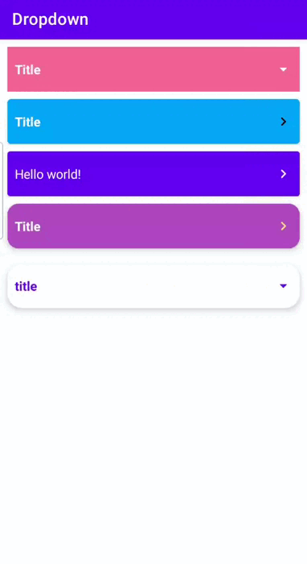

[](https://jitpack.io/#farasource/dropdown)
-
Simple Dropdown TextView For Android



## Getting Started

To start working with dropdown, you need to add its dependency into your `build.gradle` file:
### Dependency
```groovy
dependencies {
    implementation "com.github.farasource:dropdown:[latest_version]"
}
```

Then you need to add jitpack as your maven repository in `build.gradle`  file:

```groovy
repositories {
    google()
    jcenter()
    maven { url 'https://jitpack.io' }
}
```

## Sample
There is a fully functional sample application that demonstrates the usage of dropdown, all you have to do is cloning the project and running the [sample](https://github.com/farasource/dropdown/tree/master/sample) module.
## How to use

Use dropdown in the layout pragmatically
```JAVA
DropdownView dropdownView = new DropdownView(context);
dropdownView.setExpanded(false); // or setExpanded(false, /* animate */true)
dropdownView.setElevation(0);
dropdownView.setCardCornerRadius(10);
dropdownView.setCardBackgroundColor(getResources().getColor(R.color.colorPrimary)); // or setCardBackground(drawable)
dropdownView.setCardBackgroundColorExpanded(getResources().getColor(R.color.colorPrimary)); // option
dropdownView.setArrow(com.farasource.component.dropdown.R.drawable.ic_round_arrow_right_24); // or setArrow(drawable)
dropdownView.setArrowTint(Color.WHITE);
dropdownView.setArrowTintExpanded(Color.WHITE); // option
dropdownView.setArrowRotation(DropdownView.RotationModel.QUARTER);
dropdownView.setUseDivider(false);
dropdownView.setDividerColor(0xffe2e2e2);
dropdownView.setDividerHeight(1);
dropdownView.setTitleBackgroundColorExpanded(Color.TRANSPARENT);
dropdownView.setTitleText("Hello world!");
dropdownView.setTitleTextColor(Color.WHITE);
dropdownView.setTitleTextColorExpanded(Color.WHITE); // option
dropdownView.setTitleTextSize(17);
//dropdownView.setTitleTypeface(typeface); // or setTitleTypeface(typeface, /* bold */ true)
dropdownView.setContentText("World world world world world..."); // or setHtmlContent(content)
dropdownView.setContentTextColor(Color.WHITE);
dropdownView.setContentTextSize(17);
//dropdownView.setContentTypeface(typeface); // or setContentTypeface(typeface, /* bold */ false)
```

Use dropdown in the layout via xml
```XML
<com.farasource.component.dropdown.DropdownView
    android:id="@+id/dropdown"
    android:layout_width="match_parent"
    android:layout_height="wrap_content"
    android:layout_marginHorizontal="10dp"
    android:layout_marginTop="10dp"
    android:elevation="3dp"
    app:arrow="@drawable/ic_round_arrow_right_24"
    app:arrowRotation="quarter"
    app:arrowTint="@color/white"
    app:arrowTintExpanded="@color/white"
    app:cardBackground="@color/colorPrimary"
    app:cardBackgroundExpanded="@color/colorPrimary"
    app:cardCornerRadius="10dp"
    app:contentText="@string/def_text"
    app:contentTextBold="false"
    app:contentTextColor="@color/white"
    app:contentTextFont="fonts/font.ttf"
    app:contentTextSize="17dp"
    app:dividerColor="#e2e2e2"
    app:dividerHeight="1dp"
    app:elevation="0dp"
    app:expanded="false"
    app:titleBackgroundExpanded="@color/colorPrimary"
    app:titleText="@string/app_name"
    app:titleTextBold="true"
    app:titleTextColor="@color/white"
    app:titleTextColorExpanded="@color/white"
    app:titleTextFont="fonts/font.ttf"
    app:titleTextSize="17dp"
    app:useDivider="false" />
```

## Author & support
This project was created by [Abbas Ghasemi](https://farasource.com/).
> You can help us to keep my open source projects up to date!